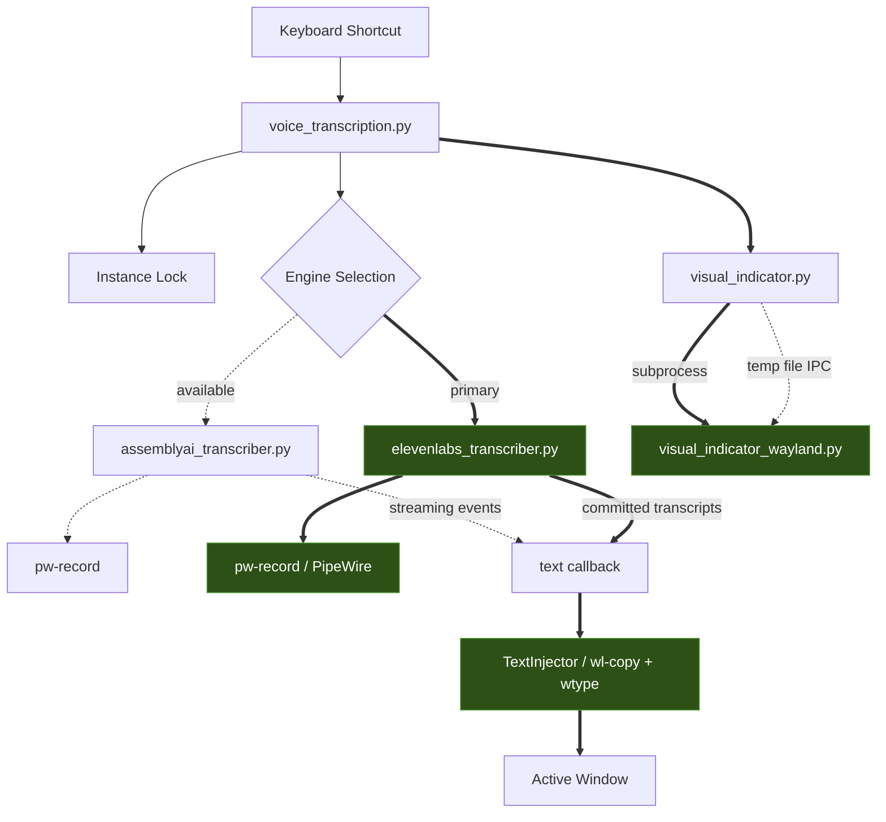
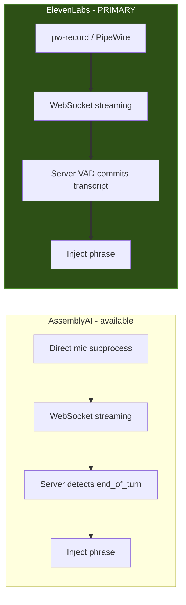
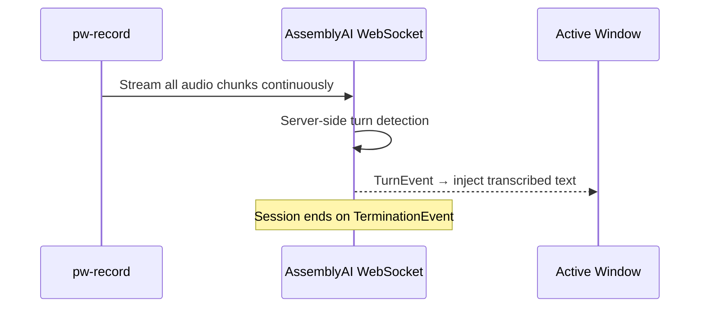
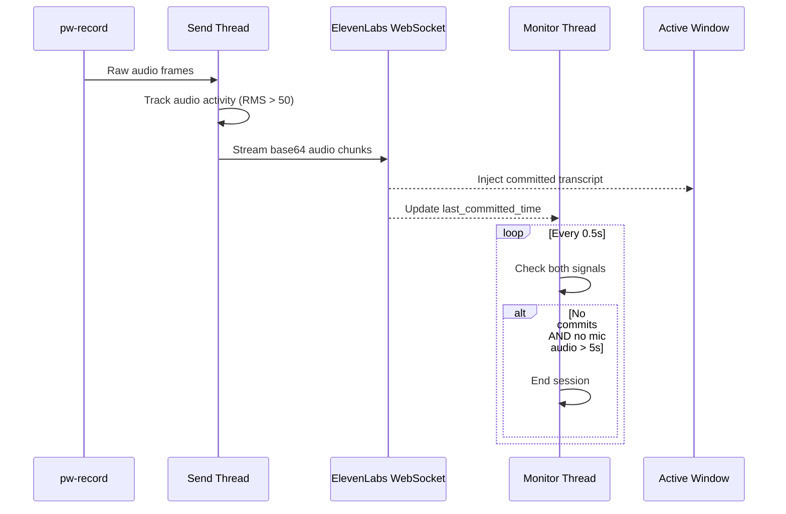
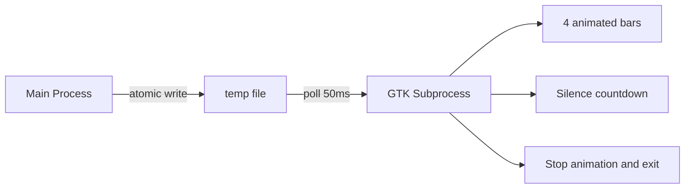

# Architecture

## System Overview

The system is triggered by a keyboard shortcut (Cosmic DE) which launches the main orchestrator. After acquiring an instance lock, it selects a transcription engine and spawns a visual indicator. Both engines produce text callbacks that feed into the TextInjector, which pastes results into the active window.

**Current setup:** Cosmic DE (Wayland), ElevenLabs engine, PipeWire audio via `pw-record`, text injection via `wl-copy` + `wtype`.

## Engine Comparison

Both engines use WebSocket streaming with server-side speech detection. AssemblyAI uses its SDK's streaming client with turn-based events. ElevenLabs uses a direct WebSocket connection to Scribe v2 Realtime with server-side VAD.

| Aspect | AssemblyAI | ElevenLabs |
|--------|-----------|------------|
| Protocol | WebSocket (SDK) | WebSocket (direct) |
| Model | Streaming v3 | Scribe v2 Realtime |
| Audio handling | Own subprocess + threads | Own subprocess + threads |
| Phrase detection | Server-side turn events | Server-side VAD (0.7s silence) |
| Session end | Server TerminationEvent | Dual-signal: no commits AND no mic audio for 5s |
| Vocabulary priming | `keyterms_prompt` (list) | `previous_text` (context string) |
| Latency | ~150ms partials | ~150ms partials |

## Audio Pipeline

Audio is captured from the system microphone as raw 16kHz 16-bit mono frames via `pw-record`/`parecord`/`arecord`. Each engine handles VAD differently:

### AssemblyAI (server-side VAD)
Audio streams continuously to the server. AssemblyAI's server detects turn boundaries and emits `TurnEvent`s with finalized text. No client-side VAD or audio accumulation.

### ElevenLabs (server VAD + local audio activity)
Audio streams continuously to the server. ElevenLabs server VAD commits transcript at phrase boundaries (0.7s silence). The local monitor tracks two signals for session end: server commit timestamps AND mic audio activity (RMS volume). Session ends only when BOTH signals show 5s of inactivity, preventing premature stops when user pauses between sentences.

## Visual Indicator

The visual indicator is a small GTK3 floating overlay showing 4 animated bars in the bottom-right corner. It runs as a separate process to avoid blocking the transcription pipeline. The main process writes volume levels to a temp file; the GTK process polls it every 50ms. Writing "stop" to the file triggers a brief animation before exit.

Uses `gtk-layer-shell` for Wayland overlay positioning (`visual_indicator_wayland.py`).

## Design Decisions

### No PyAudio
Uses `pw-record` (PipeWire, current), `parecord` (PulseAudio), or `arecord` (ALSA) via subprocess. Avoids PyAudio's device enumeration complexity and build issues. More reliable with modern PipeWire stacks.

### Dual-signal silence detection (ElevenLabs)
Session end requires two independent signals to both show inactivity:
- **Server commits** - no ElevenLabs VAD commit for 5s
- **Mic audio activity** - no audio above RMS threshold (50) for 5s

This prevents premature stops when the server hasn't committed yet but the user is still speaking (e.g., pausing between sentences).

### Subprocess Visual Indicator
GTK runs in a separate process because the GTK main loop would block transcription. Temp file IPC is simple and sufficient at 50ms polling. Clean lifecycle: kill subprocess = cleanup.

### Clipboard-based text injection
- **Wayland (current):** `wl-copy` + `wtype` keystroke
- **X11:** `xsel` + `xdotool` keystroke

Clipboard approach preferred over direct typing because `xdotool type` has issues with non-ASCII characters (Czech diacritics). Terminal detection switches paste key: `Ctrl+V` vs `Ctrl+Shift+V`.

### Instance Locking
PID-based lock file prevents overlapping sessions. Checks if PID is still alive before acquiring, auto-cleans stale locks from crashed sessions.

### Vocabulary Priming
Both engines support priming the model with domain-specific terms:
- **AssemblyAI**: `keyterms_prompt` - list of terms sent after connection
- **ElevenLabs**: `previous_text` field on first audio chunk - context string that primes the model for tech vocabulary
