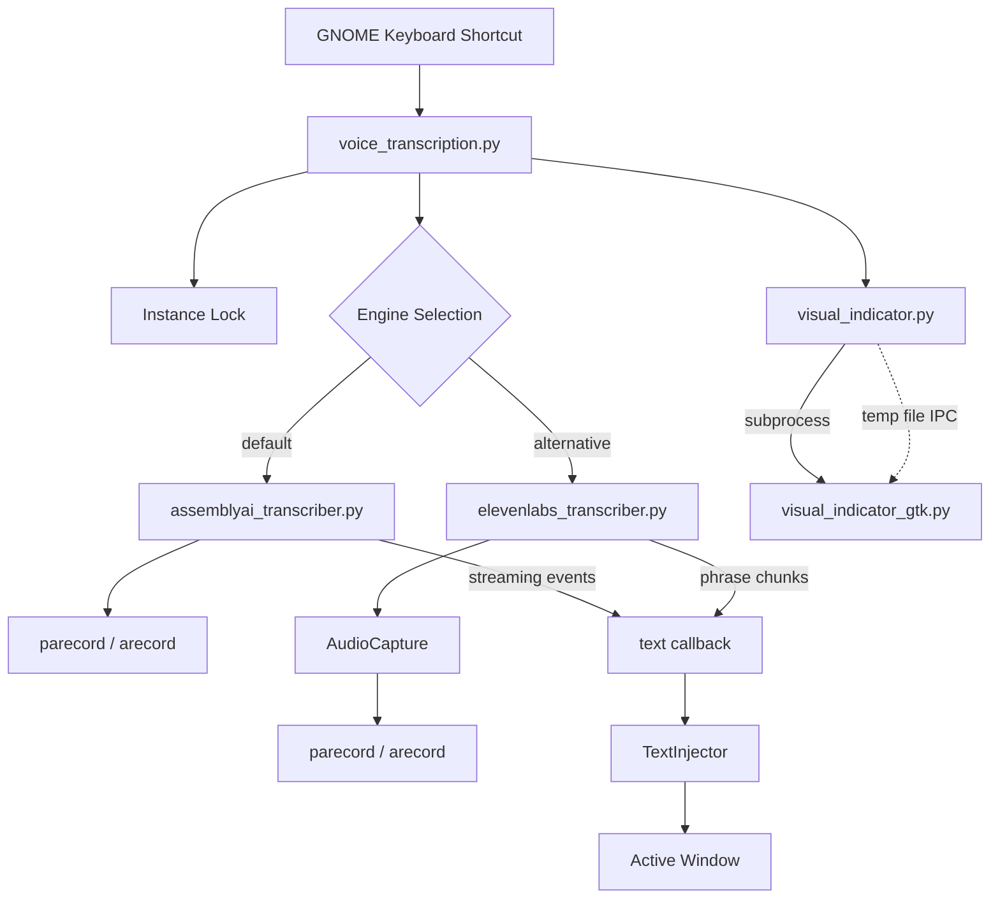
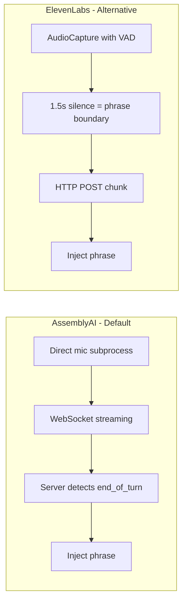
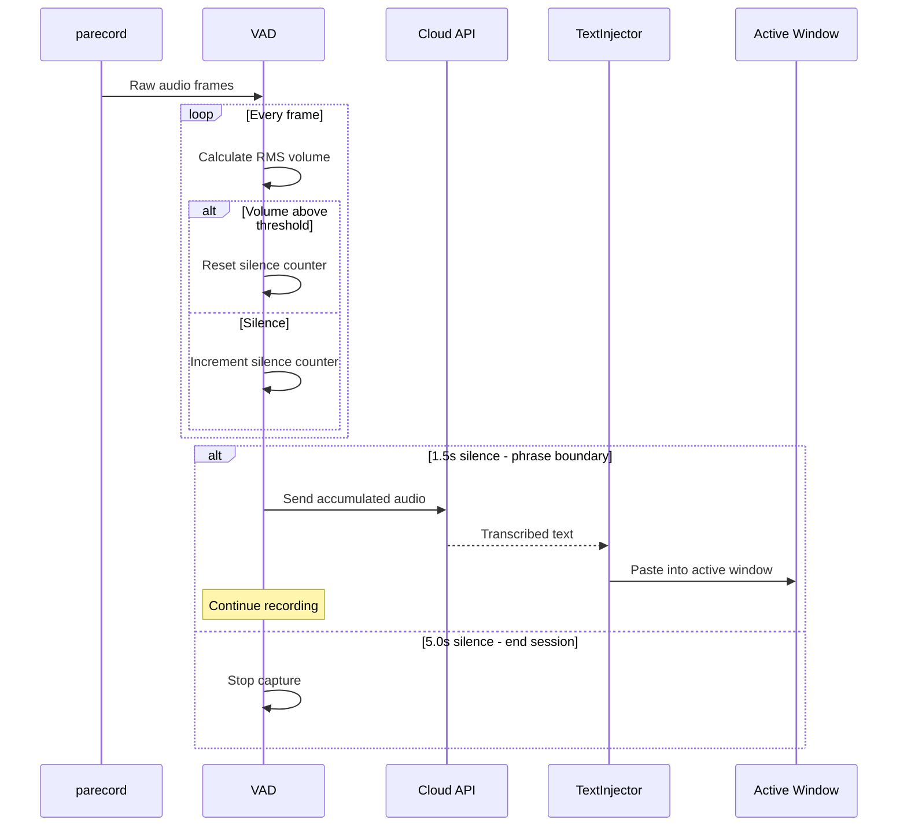
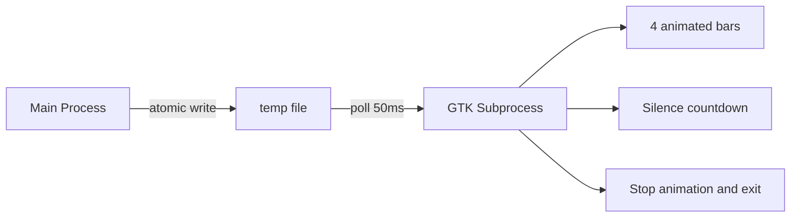

# Architecture

## System Overview

The system is triggered by a GNOME keyboard shortcut which launches the main orchestrator. After acquiring an instance lock, it selects a transcription engine and spawns a visual indicator. Both engines produce text callbacks that feed into the TextInjector, which pastes results into the active window.

## Engine Comparison

The two engines differ fundamentally in how they handle audio and detect phrase boundaries. AssemblyAI uses a persistent WebSocket connection with server-side turn detection. ElevenLabs relies on client-side VAD to split audio into chunks sent as individual HTTP requests.

| Aspect | AssemblyAI | ElevenLabs |
|--------|-----------|------------|
| Protocol | WebSocket streaming | HTTP POST per chunk |
| Audio handling | Own subprocess + timeout thread | Shared AudioCapture with VAD |
| Phrase detection | Server-side turn events | Client-side 1.5s silence threshold |
| Retry logic | Reconnect on error | 2 retries with exponential backoff |
| Latency | Real-time streaming | ~0.7-2.1s per phrase |

## Audio Pipeline

Audio is captured from the system microphone as raw 16kHz 16-bit mono frames. The VAD monitors volume levels continuously. When silence exceeds 1.5s, the accumulated audio is sent for transcription and the result is injected - but recording continues. Only after 5s of silence does the session end.

## Visual Indicator

The visual indicator is a small GTK3 floating overlay showing 4 animated bars in the bottom-right corner. It runs as a separate process to avoid blocking the transcription pipeline. The main process writes volume levels to a temp file; the GTK process polls it every 50ms. Writing "stop" to the file triggers a brief animation before exit.

## Design Decisions

### No PyAudio
Uses `parecord` (PulseAudio) or `arecord` (ALSA) via subprocess. Avoids PyAudio's device enumeration complexity and build issues. More reliable with modern PipeWire/GNOME stacks.

### Dual-threshold VAD
Two silence thresholds serve different purposes:
- **1.5s** = phrase boundary (transcribe accumulated audio, keep recording)
- **5.0s** = end of session (user stopped talking)

This enables progressive injection without premature session termination.

### Subprocess Visual Indicator
GTK runs in a separate process because the GTK main loop would block transcription. Temp file IPC is simple and sufficient at 50ms polling. Clean lifecycle: kill subprocess = cleanup.

### Clipboard over xdotool type
Default injection uses clipboard (`xsel`) + paste keystroke because `xdotool type` has issues with non-ASCII characters (Czech diacritics). Terminal detection switches paste key: `Ctrl+V` vs `Ctrl+Shift+V`.

### Instance Locking
PID-based lock file prevents overlapping sessions. Checks if PID is still alive before acquiring, auto-cleans stale locks from crashed sessions.

### Keyterms Boosting (AssemblyAI)
~50 tech vocabulary terms (Git, TypeScript, Docker, etc.) improve recognition accuracy for developer-focused dictation.
