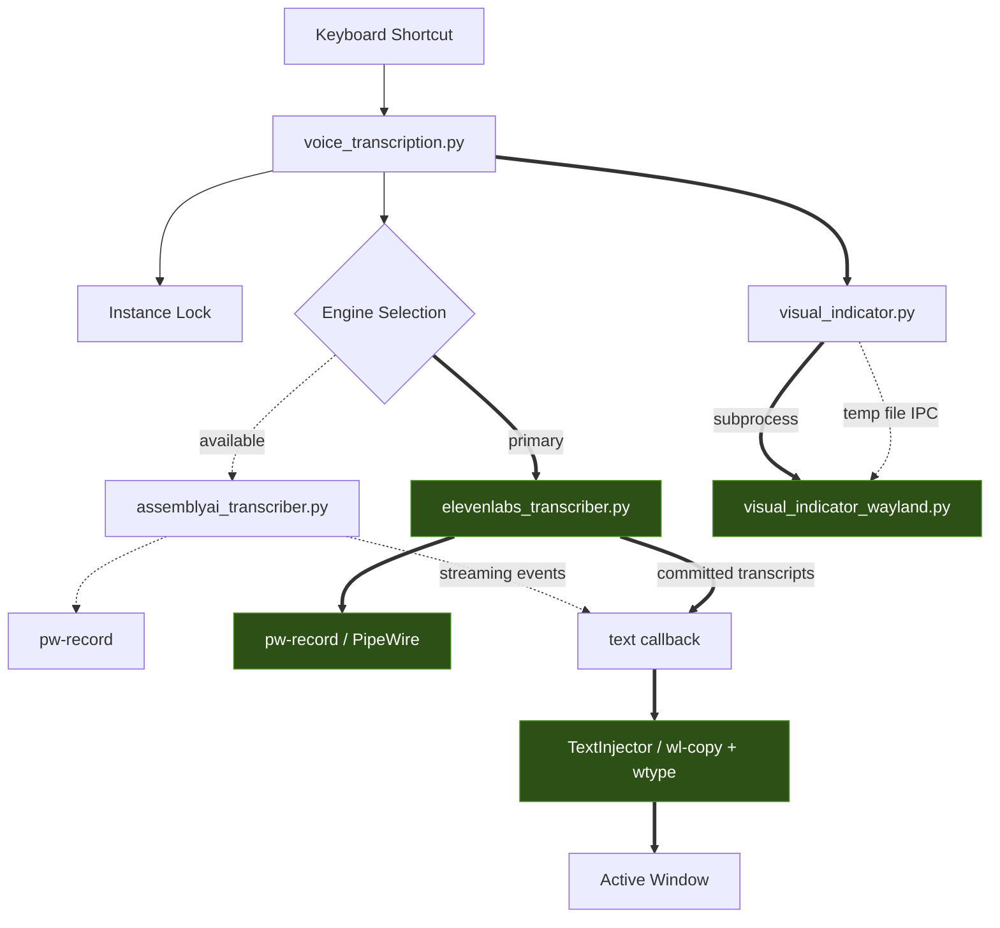
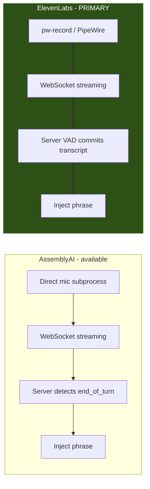
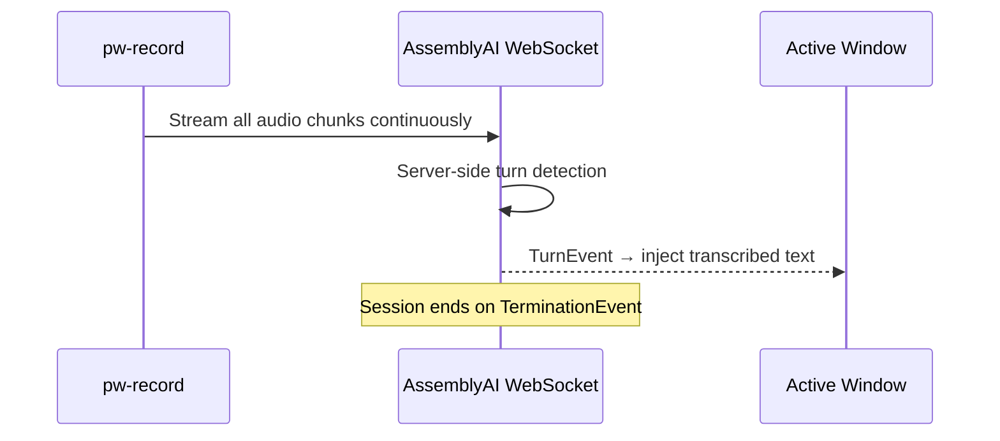
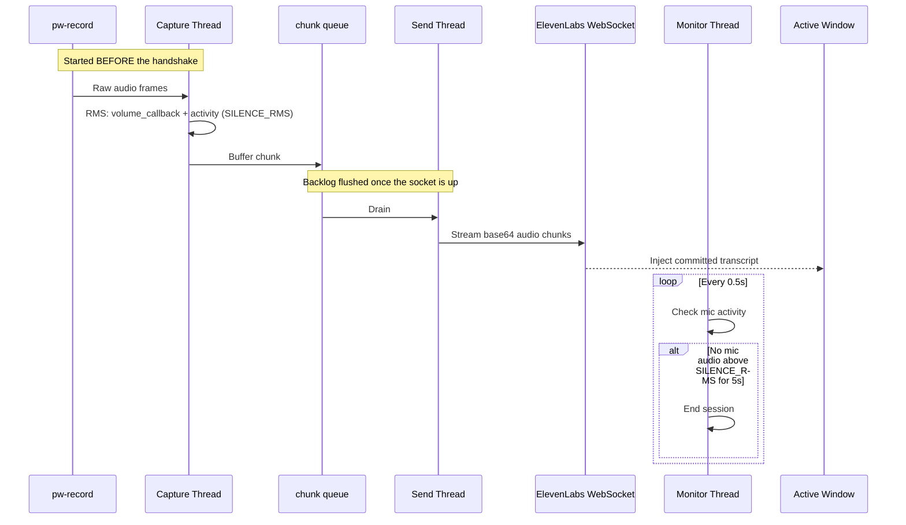
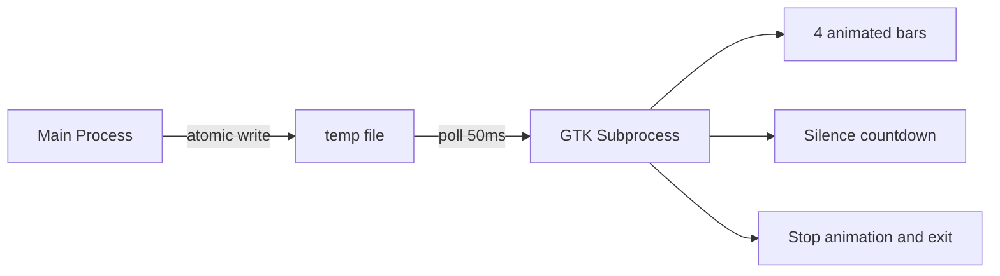

# Architecture

## System Overview

The system is triggered by a keyboard shortcut (Cosmic DE) which launches the main orchestrator. After acquiring an instance lock, it selects a transcription engine and spawns a visual indicator. Both engines produce text callbacks that feed into the TextInjector, which pastes results into the active window.

**Current setup:** Cosmic DE (Wayland), ElevenLabs engine, PipeWire audio via `pw-record`, text injection via `wl-copy` + `wtype`.

```mermaid
graph TD
    KS[Keyboard Shortcut] --> VT[voice_transcription.py]
    VT --> LOCK[Instance Lock]
    VT --> ENGINE{Engine Selection}
    ENGINE -.->|available| AAI[assemblyai_transcriber.py]
    ENGINE ==>|primary| EL[elevenlabs_transcriber.py]

    AAI -.-> MIC1[pw-record]
    EL ==> MIC2[pw-record / PipeWire]

    AAI -.->|streaming events| CB[text callback]
    EL ==>|committed transcripts| CB
    CB ==> TI[TextInjector / wl-copy + wtype]
    TI ==> WIN[Active Window]

    VT ==> VI[visual_indicator.py]
    VI ==>|subprocess| GTK[visual_indicator_wayland.py]
    VI -.->|temp file IPC| GTK

    style EL fill:#2d5016,stroke:#4a8c2a,color:#fff
    style MIC2 fill:#2d5016,stroke:#4a8c2a,color:#fff
    style TI fill:#2d5016,stroke:#4a8c2a,color:#fff
    style GTK fill:#2d5016,stroke:#4a8c2a,color:#fff
```

## Engine Comparison

Both engines use WebSocket streaming with server-side speech detection. AssemblyAI uses its SDK's streaming client with turn-based events. ElevenLabs uses a direct WebSocket connection to Scribe v2 Realtime with server-side VAD.

```mermaid
graph LR
    subgraph AAI[AssemblyAI - available]
        A1[Direct mic subprocess] --> A2[WebSocket streaming]
        A2 --> A3[Server detects end_of_turn]
        A3 --> A4[Inject phrase]
    end

    subgraph EL[ElevenLabs - PRIMARY]
        E1[pw-record / PipeWire] ==> E2[WebSocket streaming]
        E2 ==> E3[Server VAD commits transcript]
        E3 ==> E4[Inject phrase]
    end

    style EL fill:#2d5016,stroke:#4a8c2a,color:#fff
```

| Aspect | AssemblyAI | ElevenLabs |
|--------|-----------|------------|
| Protocol | WebSocket (SDK) | WebSocket (direct) |
| Model | Streaming v3 | Scribe v2 Realtime |
| Audio handling | Capture thread + queue, started pre-handshake | Capture thread + queue, started pre-handshake |
| Phrase detection | Server-side turn events | Server-side VAD (1.0s silence) |
| Session end | Server TerminationEvent | No mic audio above SILENCE_RMS for 5s |
| Vocabulary priming | `keyterms_prompt` (list) | `previous_text` (context string) |
| Latency | ~150ms partials | ~150ms partials |

## Audio Pipeline

Audio is captured from the system microphone as raw 16kHz 16-bit mono frames via `pw-record`/`parecord`/`arecord`. Each engine handles VAD differently:

### AssemblyAI (server-side VAD)
Audio streams continuously to the server. AssemblyAI's server detects turn boundaries and emits `TurnEvent`s with finalized text. No client-side VAD or audio accumulation.

```mermaid
sequenceDiagram
    participant Mic as pw-record
    participant API as AssemblyAI WebSocket
    participant Win as Active Window

    Mic->>API: Stream all audio chunks continuously
    API->>API: Server-side turn detection
    API-->>Win: TurnEvent → inject transcribed text
    Note over API: Session ends on TerminationEvent
```

### ElevenLabs (server VAD + local audio activity)
Audio streams continuously to the server. ElevenLabs server VAD commits transcript at phrase boundaries (1.0s silence). Session end is driven by mic audio activity alone: 5s below `audio_levels.SILENCE_RMS` and the monitor stops, which coincides with the overlay finishing its fade.

A capture thread owns the mic and hands chunks to the send thread through a queue. That split exists so the recorder can start *before* the WebSocket handshake - the overlay is on screen and the user is already talking while the token request and connect are still in flight, so anything captured meanwhile is buffered and flushed once the socket opens.

```mermaid
sequenceDiagram
    participant Mic as pw-record
    participant Cap as Capture Thread
    participant Q as chunk queue
    participant Send as Send Thread
    participant WS as ElevenLabs WebSocket
    participant Mon as Monitor Thread
    participant Win as Active Window

    Note over Mic,Cap: Started BEFORE the handshake
    Mic->>Cap: Raw audio frames
    Cap->>Cap: RMS: volume_callback + activity (SILENCE_RMS)
    Cap->>Q: Buffer chunk
    Note over Q,Send: Backlog flushed once the socket is up
    Q->>Send: Drain
    Send->>WS: Stream base64 audio chunks
    WS-->>Win: Inject committed transcript

    loop Every 0.5s
        Mon->>Mon: Check mic activity
        alt No mic audio above SILENCE_RMS for 5s
            Mon->>Mon: End session
        end
    end
```

## Visual Indicator

The visual indicator is a small GTK3 floating overlay showing 4 animated bars centered at the bottom of the screen. It runs as a separate process to avoid blocking the transcription pipeline. The main process writes volume levels to a temp file; the GTK process polls it every 50ms. Writing "stop" to the file triggers a brief animation before exit.

On Wayland/Cosmic DE, uses `gtk-layer-shell` for proper overlay positioning (`visual_indicator_wayland.py`). On X11, uses standard GTK window hints (`visual_indicator_gtk.py`).

```mermaid
graph LR
    VT[Main Process] -->|atomic write| TF[temp file]
    TF -->|poll 50ms| GTK[GTK Subprocess]
    GTK --> BARS[4 animated bars]
    GTK --> DECAY[Silence countdown]
    GTK --> STOP[Stop animation and exit]
```

## Design Decisions

### No PyAudio
Uses `pw-record` (PipeWire, current), `parecord` (PulseAudio), or `arecord` (ALSA) via subprocess. Avoids PyAudio's device enumeration complexity and build issues. More reliable with modern PipeWire stacks.

### Mic-silence session end (ElevenLabs)
The session ends after 5s with no mic audio above `audio_levels.SILENCE_RMS`. Because the overlay fades on the same constant, the session ends exactly as the indicator disappears - the user gets an unambiguous "done, start another" signal instead of a session lingering on a trailing VAD commit. Server commit timestamps no longer gate session end; `last_committed_time` only drives the 10s force-commit fallback for a stalled server VAD.

### Capture before handshake
Both engines start the mic subprocess before any network work (token request, WebSocket connect, `client.connect()`), with a capture thread buffering into a `queue.Queue`. Previously the recorder started only after the handshake, while the overlay was already inviting the user to speak, so the first 1-3s were lost. The buffering must be a thread rather than the stdout pipe: the 64KB pipe holds only ~2s of 16kHz mono PCM before `pw-record` blocks.

### Two audio level floors
`audio_levels.py` is stdlib-only so both the venv transcribers and the system-python GTK subprocesses can import it. It keeps two separate floors, and collapsing them is a bug: `SILENCE_RMS` (120) answers "is anyone talking" for the overlay fade and the silence timeout, while `DISPLAY_FLOOR_RMS` (300) is the bottom of the bar display. A single linear `volume / 250` mapping previously served both and clipped every real speech chunk to 1.0, freezing the bars at full height.

### Subprocess Visual Indicator
GTK runs in a separate process because the GTK main loop would block transcription. Temp file IPC is simple and sufficient at 50ms polling. Clean lifecycle: kill subprocess = cleanup.

### Clipboard-based text injection
- **Wayland (current):** `wl-copy` + `wtype` keystroke
- **X11:** `xsel` + `xdotool` keystroke

Clipboard approach preferred over direct typing because `xdotool type` has issues with non-ASCII characters (Czech diacritics). Terminal detection switches paste key: `Ctrl+V` vs `Ctrl+Shift+V`.

### Instance Locking
PID-based lock file prevents overlapping sessions. Checks if PID is still alive before acquiring, auto-cleans stale locks from crashed sessions.

### Vocabulary Priming
Both engines support priming the model with domain-specific terms:
- **AssemblyAI**: `keyterms_prompt` - list of terms sent after connection
- **ElevenLabs**: `previous_text` field on first audio chunk - context string that primes the model for tech vocabulary
